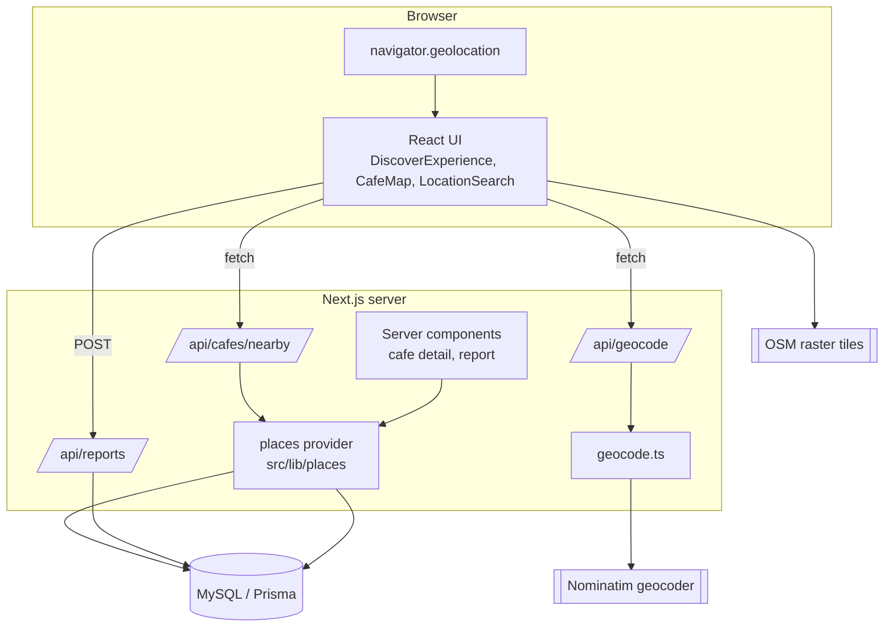

# Architecture

## Overview
CupScout is a single Next.js application. The browser runs React (client
components for location/map/search), Next.js route handlers provide the JSON API,
and Prisma talks to MySQL. External calls (map tiles, geocoding) are isolated so
they can be swapped or mocked.

## Frontend
- **Home (`/`)** is client-driven (`DiscoverExperience`) because it depends on
  device geolocation. It orchestrates: location gate → reverse geocode →
  coverage check → nearby fetch → list/map rendering + filters/search.
- **Cafe detail (`/cafes/[slug]`)** and **report (`/cafes/[slug]/report`)** are
  **server components** (better for metadata/SEO/first paint) with small client
  islands for actions and the map.
- **Map** is loaded via `next/dynamic({ ssr:false })` — Leaflet needs `window`.

## Backend (route handlers)
- `GET /api/cafes/nearby` — validated with Zod, enforces coverage, delegates to
  the places provider, applies ranking/sort.
- `GET /api/geocode` — server-side Nominatim proxy (keeps User-Agent + rate
  policy server-side).
- `POST /api/reports` — validates + persists user corrections.

## Domain layer (`src/lib`)
- `geo.ts` — coverage bounds, `regionForCoords`, haversine. **Tested.**
- `hours.ts` — `isOpenNow`. **Tested.**
- `places/` — provider interface (`types.ts`), curated implementation
  (`curated.ts`), transparent ranking (`ranking.ts`), factory (`index.ts`).
- `geocode.ts` — Nominatim client (server-only).

## Data flow: "find cafes near me"
1. User taps **Use my location** → `useGeolocation` gets coords.
2. Client calls `/api/geocode?lat&lng` → locality label + coverage check.
3. If covered, client calls `/api/cafes/nearby?lat&lng&…`.
4. Route validates, resolves region, calls `provider.searchNearby()`.
5. Provider queries Prisma, computes distance/open-now, ranks, returns summaries.
6. UI renders list + map; hovering/selecting syncs list ↔ map.

## Extensibility
Swapping the data source is a config change (`PLACES_PROVIDER`) + a new class
implementing `PlacesProvider`. No feature/UI code changes required.
