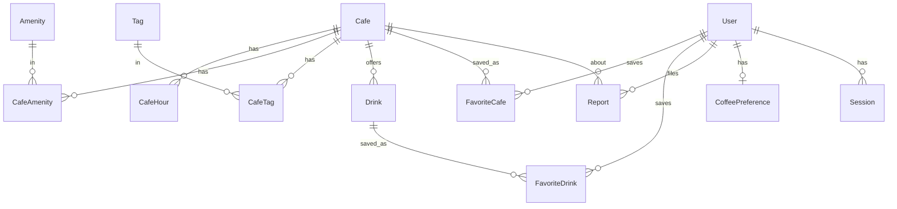

# Database

- **Engine:** MySQL / MariaDB (XAMPP in dev). Charset `utf8mb4`.
- **ORM:** Prisma (`prisma/schema.prisma`). Client singleton in `src/lib/prisma.ts`.
- **Schema management (dev):** `npm run db:push`. Migrations can be introduced
  with `prisma migrate` for production.

## ER diagram

## Tables
| Table | Purpose | Notable columns |
|---|---|---|
| `Cafe` | Core entity | `slug` (unique), `region`, `latitude/longitude`, nullable `rating/reviewCount/priceLevel`, `source`, `featured/featuredRank` |
| `CafeHour` | Opening hours per weekday | `weekday 0..6`, `opensMin`, `closesMin` (>1440 = past midnight) |
| `Amenity` / `CafeAmenity` | Amenities + join | `key` (wifi, outlets…) |
| `Tag` / `CafeTag` | Purpose tags + join | `key` (study, work, date…) |
| `Drink` | Menu items (when known) | `category`, nullable `price`, flavor booleans |
| `User` | Accounts | `email` (unique), `passwordHash`, `role`, `suspended` |
| `Session` | Auth sessions | `tokenHash` (unique), `expiresAt` |
| `CoffeePreference` | Explicit coffee profile | one row per user |
| `FavoriteCafe` / `FavoriteDrink` | Saves | composite PKs |
| `Report` | User corrections → admin | `kind`, `status`, `details` |
| `AnalyticsEvent` | Lightweight event log | `name`, `properties` (JSON), `region` |

## Enums
`Region` (LUZON, SWITZERLAND) · `DataSource` (CURATED, EXTERNAL, USER) ·
`PriceLevel` (BUDGET, MODERATE, EXPENSIVE) · `DrinkCategory` ·
`Role` (USER, ADMIN) · `ReportKind` · `ReportStatus`.

## Indexes
`Cafe`: `region`, `(latitude, longitude)`, `(featured, featuredRank)`.
Join tables index their non-PK side. `Report`: `status`, `cafeId`.
`AnalyticsEvent`: `name`, `createdAt`. See `schema.prisma` for the full list.

## Data ownership
Nullable business fields (`rating`, `hours`, `price`, `drinks`) are null when we
have no real source — see [DATA-SOURCES.md](DATA-SOURCES.md). `source`/`sourceName`
record provenance for attribution.

## Notes / limitations
- Distance queries use in-app haversine (no spatial index); fine for the curated
  dataset size. Revisit with PostGIS/generated columns if the dataset grows.
