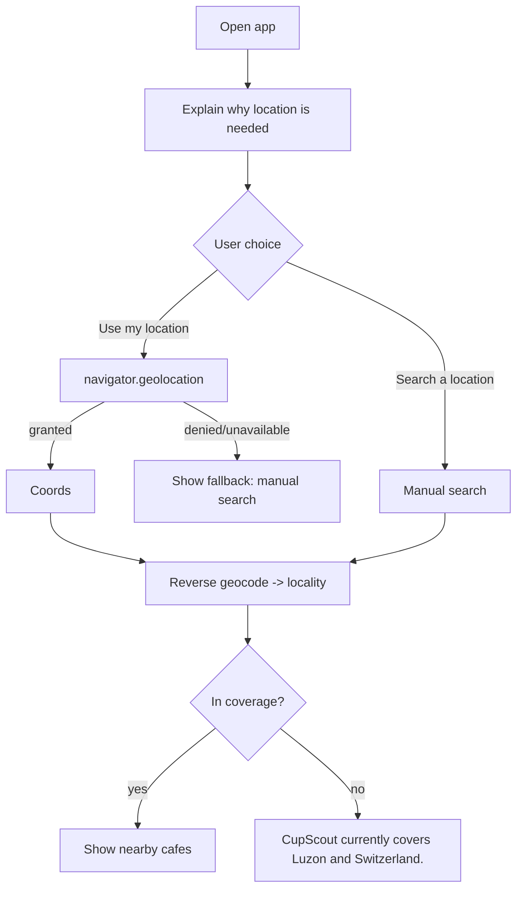

# Location

## Geolocation flow
Location is the primary discovery mechanism, but we **explain before asking**.

- We **do not** auto-trigger the browser permission prompt. The intro card
  (`LocationIntro` in `DiscoverExperience`) explains usage first, then the user
  taps **Use my location** (`useGeolocation.request()`).
- Options: `enableHighAccuracy`, 10s timeout, 60s max cached age.

## Coverage enforcement
Defined in `src/lib/geo.ts`:
- `REGION_BOUNDS` — approximate bounding boxes for LUZON and SWITZERLAND.
- `regionForCoords(point)` → `Region | null`.
- `isCovered(point)` and `COVERAGE_MESSAGE`.

Enforced at:
- **`/api/geocode`** — reverse geocode returns `covered:false` outside bounds.
- **`/api/cafes/nearby`** — rejects out-of-coverage origins before querying.
- **UI** — shows the coverage message + manual search.

> The bounding boxes are approximate; a cafe's authoritative region is its stored
> `region` column. Mindanao/Visayas coordinates (PH but not Luzon) are correctly
> rejected — see the test in `src/lib/geo.test.ts`.

## Nearby vs. Exploring (distance semantics)
Coverage is all of Luzon + Switzerland, but **"nearby" means actually nearby**:
- **Near you** — origin is device GPS. Header shows "Good coffee, near you · {locality}".
- **Exploring {place}** — origin is a location the user *searched* (or a
  "Search this area" map center). The UI says "Exploring {place}", never "Near
  you", so we don't pretend the user is physically there.

**Radius, with explicit expansion** (`/api/cafes/nearby`):
- Default nearby radius is **5 km**. Distances are real (haversine from origin to
  each cafe's coordinates — never a stored/estimated field).
- If nothing is within the radius, the UI says "No cafes within 5 km" and offers
  **Expand to 10 → 25 → 50 km** — it never silently shows a cafe 150 km away.
- A **text search** (`q`) searches the whole covered region instead of a radius.
- The map centers on the origin; "Search this area" re-centers discovery on the
  current map view.

## Manual fallback
`LocationSearch` (debounced) calls `/api/geocode?q=` which is restricted to
`countrycodes=ph,ch` and filtered to coverage. Users can search city / town /
area / landmark. Selecting a result sets a manual origin.

## Privacy
- Coordinates are used only to find cafes and look up the locality label.
- Reverse geocoding is a server call to Nominatim; we send only lat/lng, never
  user identity.
- No location history is stored. Coordinates are never placed in URLs we persist.
- `Permissions-Policy: geolocation=(self)` is set in `next.config.mjs`.
