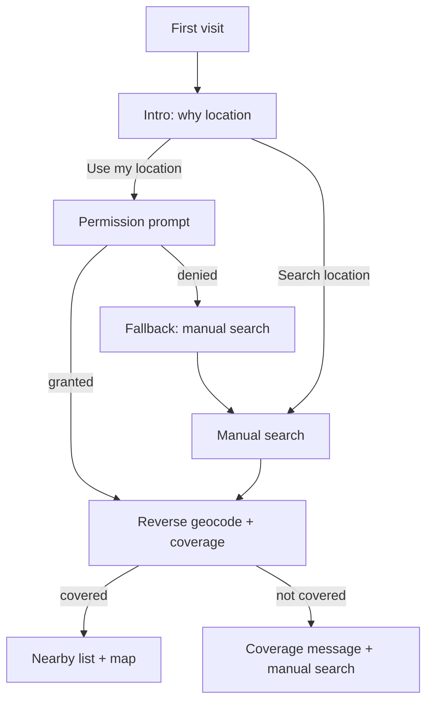
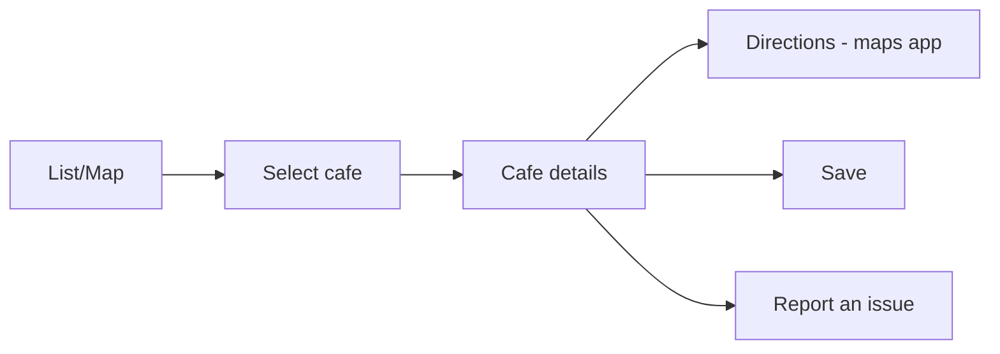
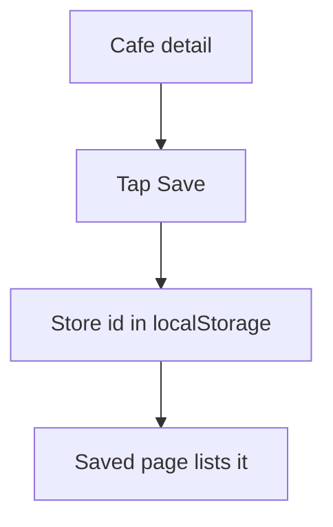
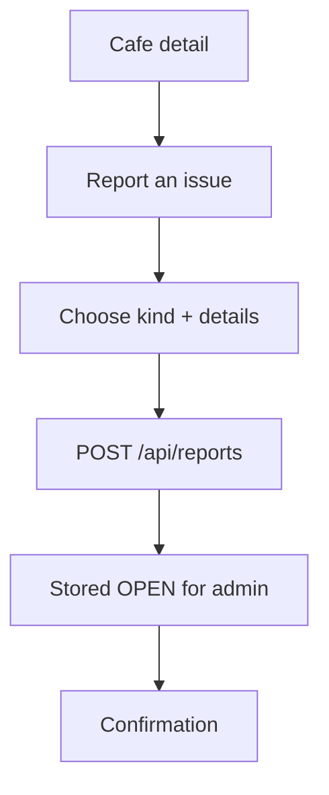

# User Flows

## First visit → discovery

## Cafe discovery → details → action

## Save a cafe (guest)

## Report incorrect info

## Navigation & theming (0.3.0)
- **Desktop:** top bar — brand → Discover / Where to go / What to order / Saved,
  plus theme toggle + account.
- **Mobile:** bottom tab bar — Discover / Where / Order / Saved; account + theme
  in the top bar.
- **Theme:** light/dark via the toggle (persisted) or the OS default.
- **Admin:** entered from the account area (admins only); consumer nav is hidden
  under `/admin`.

## Planned flows (design)
- **Account creation / login** — [AUTHENTICATION.md](AUTHENTICATION.md)
- **Drink recommendation ("What should I get?")** — [RECOMMENDATIONS.md](RECOMMENDATIONS.md)
- **Admin: triage reports, edit/merge cafes, curate features** — [ADMIN.md](ADMIN.md)
